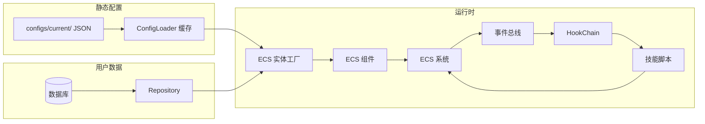

# HSR 模拟器架构设计文档

## 1. 项目概述

本项目旨在构建一个高保真、可扩展的《崩坏：星穹铁道》战斗模拟器，用于角色强度计算、配装优化、AI 策略验证及蒙特卡洛批量分析。系统采用 **数据驱动** 和 **ECS（实体-组件-系统）** 架构，支持复杂的技能机制、动态效果插入和版本化配置管理。

## 2. 核心技术栈

| 类别 | 技术选型 | 用途 |
| :--- | :--- | :--- |
| 语言 | Python 3.13+ | 主开发语言 |
| 包管理 | uv | 依赖管理与虚拟环境 |
| 数据验证 | Pydantic V2 | 静态配置模型、运行时组件、事件定义 |
| ECS 框架 | Esper 3.x | 运行时实体与组件管理 |
| 数据库 ORM | SQLAlchemy 2.0 | 用户实例数据、对局记录持久化 |
| 数据库迁移 | Alembic | 数据库 Schema 版本控制 |
| 事件总线 | eventure | 系统间解耦通信 |
| 钩子系统 | 自研 HookChain | 核心流程干预点（祝福、装备效果） |
| 技能脚本 | Python 动态导入 | 实现复杂技能逻辑 |
| TUI | Textual / Rich | 交互界面与对局展示 |
| 测试 | pytest | 单元测试与集成测试 |

## 3. 项目目录结构

```text
hsr-sim/
├── .venv/                     # 虚拟环境（uv 管理）
├── .ruff_cache/               # Ruff 缓存
├── alembic/                   # Alembic 迁移脚本目录
│   ├── versions/
│   ├── env.py
│   └── script.py.mako
├── alembic.ini                # Alembic 配置文件
├── configs/                   # 静态配置文件根目录（按版本组织）
│   ├── v1.0/
│   │   ├── characters/
│   │   │   └── <character_name>/
│   │   │       ├── <character_name>.json
│   │   │       ├── skills/
│   │   │       ├── eidolons/
│   │   │       ├── talent/
│   │   │       ├── technique/
│   │   │       └── bonus_ability/
│   │   ├── light_cones/
│   │   └── relics/
│   ├── v1.1/
│   └── ...
├── data/                      # 运行时数据文件
│   └── hsr.db                 # SQLite 数据库文件
├── docs/                      # 设计文档
├── scripts/                   # 辅助脚本（初始化、导入等）
├── src/
│   └── hsr_sim/               # 主包
│       ├── __init__.py
│       ├── __main__.py        # 程序入口
│       ├── py.typed           # 类型标记文件
│       │
│       ├── core/              # 核心配置与基础异常
│       │   ├── __init__.py
│       │   ├── config.py      # 全局设置（路径、版本等）
│       │   └── exceptions.py  # 自定义异常类
│       │
│       ├── models/            # 数据模型定义
│       │   ├── __init__.py
│       │   ├── schemas/       # 静态配置 Pydantic 模型（只读），用于读取configs目录下的数据
│       │   │   ├── __init__.py
│       │   │   ├── enums.py   # 所有共享枚举（元素、命途、属性类型等）
│       │   │   ├── character.py
│       │   │   ├── skill.py
│       │   │   ├── light_cone.py
│       │   │   ├── relic.py
│       │   │   └── ...
│       │   └── db/            # SQLAlchemy ORM 模型（持久化）
│       │       ├── __init__.py
│       │       ├── base.py    # declarative_base()
│       │       ├── user.py
│       │       ├── user_character.py
│       │       ├── user_relic.py
│       │       ├── user_light_cone.py
│       │       ├── battle_record.py
│       │       └── ...
│       │
│       ├── ecs/               # ECS 运行时
│       │   ├── __init__.py
│       │   ├── factories.py   # 从配置创建实体的工厂函数
│       │   ├── components/    # 运行时组件（Pydantic 模型）
│       │   │   ├── __init__.py
│       │   │   ├── battle_state.py  # HP, ATK, DEF, SPD, Energy 等
│       │   │   ├── resources.py     # 叠层、特殊能量
│       │   │   ├── identity.py      # 身份标识（关联配置ID）
│       │   │   └── ...
│       │   └── systems/       # ECS 系统处理器
│       │       ├── __init__.py
│       │       ├── health_system.py
│       │       ├── turn_system.py
│       │       ├── damage_system.py
│       │       └── ...
│       │
│       ├── events/            # 事件总线
│       │   ├── __init__.py
│       │   └── ...
│       │
│       ├── hooks/             # Hook 机制（流程干预）
│       │   ├── __init__.py
│       │   └── ...
│       │
│       ├── skills/            # 技能脚本系统
│       │   ├── __init__.py
│       │   ├── base.py        # BaseSkill, BasePassive 抽象类
│       │   ├── context.py     # SkillContext 依赖注入容器
│       │   ├── manager.py     # SkillManager 加载与执行
│       │   ├── active/        # 主动技能脚本
│       │   │   ├── basic_attack_1001.py
│       │   │   └── ...
│       │   └── passive/       # 被动/天赋脚本
│       │       ├── blade_hellscape.py
│       │       └── ...
│       │
│       ├── services/          # 业务服务层
│       │   ├── __init__.py
│       │   ├── config_loader.py   # 静态配置加载与缓存
│       │   ├── stat_calculator.py # 属性计算服务
│       │   └── relic_generator.py # 遗器随机生成服务
│       │
│       ├── repositories/      # 数据访问层（Repository 模式）
│       │   ├── __init__.py
│       │   ├── base.py        # 基础 Repository 类
│       │   ├── character_repo.py
│       │   ├── relic_repo.py
│       │   └── ...
│       │
│       ├── utils/             # 通用工具
│       │   ├── __init__.py
│       │   ├── db_session.py  # SQLAlchemy 会话管理
│       │   └── id_generator.py
│       │
│       └── logger/
│
└── tests/                     # 单元测试目录
    ├── __init__.py
    ├── conftest.py
    ├── test_models/
    ├── test_ecs/
    └── ...
```

## 4. 核心设计原则

### 4.1 静态配置与运行时状态隔离

| 类型 | 存放位置 | 数据模型 | 可变性 | 持久化 |
| :--- | :--- | :--- | :--- | :--- |
| **静态配置** | `configs/vX.Y/` | `models/schemas/` (Pydantic) | **只读** | 不存数据库 |
| **运行时状态** | ECS 组件 | `ecs/components/` (Pydantic) | **频繁修改** | 可序列化存档 |
| **用户实例数据** | SQLite/PostgreSQL | `models/db/` (SQLAlchemy) | 用户操作修改 | 持久化 |

### 4.2 配置版本化

- 每次平衡性调整时，新建一个目录，版本号递增，并从上一版本复制整套 `configs/<old_version>/` 到 `configs/<new_version>/` 后再修改目标项。
- 扫描目录时，先按照版本号排序，从旧向新加载，并合并同一角色的不同版本。（同一角色所有文件命名一致，但是版本目录不同）
- 用户角色实例记录创建时的 `config_version` 字段，确保加载旧存档时使用当时版本的配置，保证数值稳定。
- 对局记录同样绑定 `config_version`，确保战斗回放可复现。

### 4.3 数据流向



## 5. 各模块详细说明

### 5.1 `core/` — 核心配置与基础组件

- **`config.py`**：定义全局设置，包含项目根路径、配置目录等。
- **`exceptions.py`**：自定义异常类，如 `ConfigNotFoundError`、`SkillExecutionError`。

### 5.2 `models/` — 数据模型

#### `models/schemas/` — 静态配置模型（Pydantic）

- **职责**：定义游戏元数据的结构，用于解析 `configs/` 下的 JSON 文件。
- **特点**：所有字段均有类型校验，提供 `model_validate` 方法。
- **关键文件**：
  - `enums.py`：集中定义所有枚举（`Element`, `Path`, `StatType`, `SkillType` 等），被其他模块广泛引用。
  - `character.py`：`CharacterConfig`，包含基础属性、技能槽位、星魂、行迹和 `energy`（`energy_type` + `max_energy`）等。
  - `skill.py`：`SkillConfig`，包含技能类型、脚本路径。所有技能逻辑全部使用脚本以保证统一。
  - `light_cone.py`、`relic.py`：遗器和光锥的静态定义，包含被动脚本。

#### `models/db/` — ORM 模型（SQLAlchemy）

- **职责**：定义数据库表结构，用于持久化用户数据和战斗记录。
- **特点**：仅存储**可变数据**，通过 `config_id` 和 `config_version` 引用静态配置。
- **关键表**：
  - `UserCharacter`：用户拥有的角色实例（等级、星魂、装备引用）。
  - `UserRelic`：用户背包中的遗器实例（主词条值、副词条列表、装备者）。
  - `UserLightCone`：光锥实例（等级、叠影、装备者）。
  - `BattleRecord`：对局记录（参战角色快照、事件流、结果统计）。

### 5.3 `ecs/` — 运行时 ECS

- **`world.py`**：封装 Esper 上下文管理。
- **`components/`**：定义所有运行时组件。使用 Pydantic 模型以便序列化和校验。组件分为：
  - **战斗状态**：`HealthComponent`, `AttackComponent`, `EnergyComponent` 等。
  - **资源与叠层**：`StackComponent`, `CustomEnergyComponent`。
  - **身份标识**：`CharacterIdentityComponent`（存储 `config_id` 和 `config_version`）。
- **`systems/`**：实现具体的游戏逻辑，每个 System 继承 `esper.Processor`，在 `process()` 中批量处理实体。
- **`factories.py`**：提供工厂函数，根据静态配置和用户实例数据创建完整的运行时实体。

### 5.4 `events/` — 事件总线

- **`bus.py`**：使用 Eventure 实现 `EventBus` 类，支持按优先级订阅、发布事件，并记录事件日志（用于回放）。
- **`base.py`**：定义 `GameEvent` 基类（Pydantic 模型），包含 `event_type`、`tick`、`data` 等通用字段。
- **`game_events.py`**：具体事件类，如 `DamageDealtEvent`, `EntityDiedEvent`, `TurnStartEvent`。
- **`commands.py`**：命令类事件（如 `UseSkillCommand`），代表玩家或 AI 的意图，由相应 System 处理。

### 5.5 `hooks/` — 流程干预钩子

- **`chain.py`**：`HookChain` 类，管理一系列实现了相同协议（`BattleHooks`）的钩子对象，按顺序调用并传递修改后的值。
- **`battle_hooks.py`**：定义 `BattleHooks` 协议，列出所有可干预的流程节点，如 `before_damage_calc`, `after_skill_cast`。祝福、装备、天赋等通过实现该协议介入计算。

### 5.6 `skills/` — 技能脚本系统

- **`base.py`**：定义 `BaseSkill` 抽象类，要求子类实现 `execute(caster, targets)` 方法。被动技能可继承 `BasePassive`。
- **`context.py`**：`SkillContext` 数据类，作为依赖注入容器，向脚本提供 `world`、`event_bus`、`hook_chain`、`config_loader` 等服务的访问接口，限制脚本对内部状态的随意修改。
- **`manager.py`**：`SkillManager` 负责根据 `skill_id` 动态导入对应的脚本类、实例化并执行。

### 5.7 `services/` — 业务服务

- **`config_loader.py`**：单例模式，负责加载指定版本的静态配置 JSON 文件，解析为 Pydantic 模型并缓存在内存中，提供 `get_character(version, id)` 等接口。
- **`stat_calculator.py`**：属性计算服务，汇总角色的基础属性、遗器、光锥、Buff 等所有来源，计算出最终战斗属性。
- **`relic_generator.py`**：遗器随机生成服务，根据规则生成符合约束的遗器实例并存入数据库。

### 5.8 `repositories/` — 数据访问层

- **`base.py`**：提供通用的 CRUD 方法（`get`, `add`, `update`, `delete`）。
- 各具体 Repository（如 `CharacterRepository`）继承基类，并添加业务相关的查询方法，如 `find_by_user()`。

### 5.9 `utils/` — 工具模块

- **`db_session.py`**：创建 SQLAlchemy 引擎和会话工厂，提供 `get_db()` 上下文管理器或依赖注入函数。

## 6. 关键流程示例

### 6.0 编辑角色

1. 遍历 configs 目录，扫出来所有角色配置。默认

### 6.1 创建角色并进入战斗

> 假设用户已经有实例被存储于数据库。
> 数据库中不含任何角色基础配置，全部动态加载。

1. 用户在界面选择角色实例（ID=1001，版本=v1.0）。
2. `CharacterRepository` 从数据库加载 `UserCharacter` 记录。
3. `ConfigLoader` 根据 `v1.0` 加载对应的 `CharacterConfig`。
4. `factories.create_character_from_config()` 创建 ECS 实体并添加基础组件；根据 `config.energy` 自动挂载标准能量或特殊能量组件。
5. `factories.apply_user_data()` 根据用户实例数据（星魂、遗器、光锥）修改组件属性。
6. 实体加入战斗世界，相关 System 开始运作。

### 6.2 技能释放流程

1. 玩家/AI 发布 `UseSkillCommand(skill_id=1001, caster=ent, targets=[...])`。
2. `SkillManager` 收到命令，通过 `config_loader` 获取 `SkillConfig`。
3. 检查 `CooldownComponent` 和资源消耗（通过 `HookChain` 允许祝福修改消耗）。
4. 动态导入技能脚本，实例化并传入 `SkillContext`。
5. 调用 `script.execute()`，脚本内部通过 `context` 访问 ECS 组件、发布事件、调用钩子。
6. 技能执行完毕后，更新冷却组件，发布 `SkillCastCompleteEvent`。

## 7. 开发规范

### 7.1 代码风格

- 遵循 Google Python Style，使用 Ruff 进行 lint 和格式化。
- 类型注解必须完整（函数参数、返回值）。
- 使用 `pydantic.Field` 进行字段约束和描述。

### 7.2 命名约定

- **文件名**：小写蛇形命名法 `character_repo.py`
- **类名**：大驼峰 `CharacterConfig`, `HealthComponent`
- **函数/变量**：小写蛇形 `get_character_by_id`
- **常量**：全大写蛇形 `MAX_ENERGY`

### 7.3 Git 提交规范

使用 Conventional Commits：`feat:`, `fix:`, `docs:`, `refactor:`, `test:`。

### 7.4 测试要求

- 使用 pytest。
- 每个模块应有对应的单元测试，核心战斗逻辑需有集成测试。
- 数据库测试使用内存 SQLite。

## 8. 下一步行动计划

1. **数据层完善**：完成 `ConfigLoader` 缓存机制和版本化支持，编写测试验证。
2. **基础 ECS 系统**：实现 `HealthSystem`、`DeathSystem`，完成最简单的战斗循环。
3. **事件总线**：实现 `EventBus` 及基础事件，与 ECS 系统集成。
4. **技能管理器**：实现 `SkillManager` 和 `SkillContext`，完成第一个简单技能脚本。
5. **用户实例与存档**：完善数据库 ORM 模型和 Repository，实现角色配置保存/加载。
6. **交互界面**：基于 Textual 实现角色配置管理 TUI。

---

这份文档将作为后续开发的蓝图。如果在实施过程中发现需要调整的地方，请及时更新本文档以保持同步。
