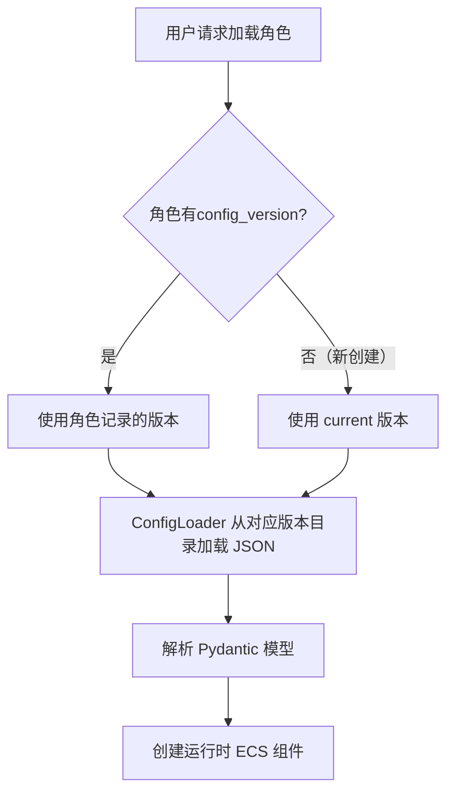

# 如何应对角色加强？

## 🎯 核心原则

1. **配置文件是唯一真相源**：所有角色、技能、遗器的数值和逻辑都由 `configs/` 目录下的 JSON 和 Python 脚本定义。
2. **数据库不冗余存储静态数据**：用户实例只记录 `character_config_id`，不存储角色的攻击力、技能描述等。
3. **对局可复现**：每一场战斗记录都必须绑定其使用的配置版本，确保日后回放或分析时，能还原当时的数值环境。

---

## 📅 角色版本变更的处理方案

### 场景描述

- **版本 1.0**：希儿的基础攻击力为 180，技能「再现」逻辑为 `script_v1.py`。
- **版本 1.1**：希儿加强，基础攻击力提升至 195，技能「再现」逻辑优化为 `script_v2.py`。

如果用户有一个在 1.0 版本创建的希儿存档，当模拟器升级到 1.1 后，直接用新配置加载旧存档会导致**属性突变**或**技能行为不一致**，破坏玩家预期。

### 解决方案：配置版本化与对局快照

#### 1️⃣ 配置文件按版本组织

```text
configs/
├── versions/
│   ├── v1.0/
│   │   ├── characters/
│   │   ├── skills/
│   │   └── ...
│   └── v1.1/
│       ├── characters/
│       ├── skills/
│       └── ...
└── current -> versions/v1.1/   # 符号链接或配置文件指向当前活跃版本
```

- 每次发布平衡性调整时，将整个 `configs/` 目录复制一份到新版本文件夹。
- `current` 始终指向最新版本，用于新创建的角色和对局。
- 旧版本配置文件**永久保留**，不删除，用于加载旧存档和回放历史对局。

#### 2️⃣ 用户实例记录创建时的版本号

在数据库表中增加 `config_version` 字段：

```python
class UserCharacter(Base):
    # ...
    config_version: str = "v1.0"  # 该角色实例创建时使用的配置版本
```

当加载一个用户角色进入战斗时，系统会：

```python
def load_character(user_char: UserCharacter):
    # 根据角色记录的版本号加载对应的静态配置
    version = user_char.config_version
    char_config = config_loader.get_character(version, user_char.character_config_id)
    # 使用该配置创建实体...
```

#### 3️⃣ 对局记录绑定配置版本

`BattleRecord` 表同样记录 `config_version` 字段，确保回放时能定位到正确的配置目录。

```python
class BattleRecord(Base):
    # ...
    config_version: str
```

#### 4️⃣ 版本迁移策略（可选）

如果希望旧角色能“享受”新版本的加强（例如基础属性提升），可以提供**手动升级**功能：

- 用户可在角色界面点击“更新至最新版本”，系统将 `config_version` 更新为 `current`，并重新计算属性（但不会改变已装备的遗器/光锥）。
- 这种操作应由用户主动触发，并给予明确提示。

#### 5️⃣ 技能脚本的版本隔离

技能脚本文件同样存放在版本目录下：

```
configs/versions/v1.0/skills/scripts/recurrence.py
configs/versions/v1.1/skills/scripts/recurrence.py
```

`SkillConfig` 中的 `script` 字段存储的是相对于版本根目录的路径（如 `skills.scripts.recurrence`），动态导入时根据当前上下文版本确定实际模块。

---

## 🔄 实际加载流程



---

## 📦 配置文件与数据库的最终职责表

| 数据类型 | 存储位置 | 版本化 | 示例内容 |
| :--- | :--- | :--- | :--- |
| **静态配置（最新）** | `configs/current/` | 否（随游戏更新整体替换） | 当前版本的角色基础数值、技能参数 |
| **静态配置（历史）** | `configs/versions/vX.Y/` | 是（每个版本一个目录） | 历史版本的所有配置快照 |
| **用户角色实例** | 数据库 `user_characters` | 记录 `config_version` 字段 | 角色ID、等级、星魂、装备引用 |
| **用户遗器实例** | 数据库 `user_relics` | 无需版本（词条是具体数值） | 主词条值、副词条列表 |
| **对局记录** | 数据库 `battle_records` | 记录 `config_version` 字段 | 战斗事件流、结果、参战角色快照 |

---

## 💎 实施建议

1. **初期可简化**：在项目早期，平衡性调整不频繁时，可以暂时只维护一个 `configs/` 目录，待第一次需要大改时再引入版本化。
2. **工具脚本**：编写一个脚本，用于一键复制当前配置到新版本目录，并更新 `current` 指向。
3. **测试覆盖**：确保 `ConfigLoader` 能根据版本号正确加载对应目录的配置，并编写单元测试验证新旧版本隔离。

这样设计后，你的模拟器既能灵活迭代平衡性，又能保证玩家存档的稳定性和对局的可复现性。
