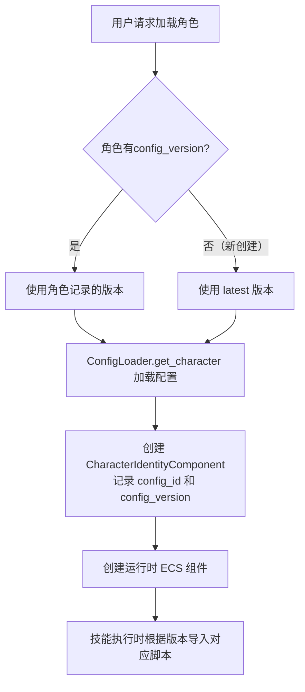

# 如何应对角色加强？

## 🎯 核心原则

1. **配置文件是唯一真相源**：所有角色、技能、遗器的数值和逻辑都由 `configs/` 目录下的 JSON 和 Python 脚本定义。
2. **数据库不冗余存储静态数据**：用户实例只记录 `character_config_id`，不存储角色的攻击力、技能描述等。
3. **对局可复现**：每一场战斗记录都必须绑定其使用的配置版本，确保日后回放或分析时，能还原当时的数值环境。

---

## 📅 角色版本变更的处理方案

### 场景描述

- **版本 1.0**：希儿的基础攻击力为 180，技能「再现」逻辑为 `seele_skill.py`。
- **版本 1.1**：希儿加强，基础攻击力提升至 195，技能「再现」逻辑优化为 `seele_skill.py`。

如果用户有一个在 1.0 版本创建的希儿存档，当模拟器升级到 1.1 后，直接用新配置加载旧存档会导致**属性突变**或**技能行为不一致**，破坏玩家预期。

### 解决方案：配置版本化与对局快照

#### 1️⃣ 配置文件按版本组织

```text
configs/
├── v1.0/
│   ├── characters/
│   │   └── seele/
│   │       ├── seele.json
│   │       └── skills/
│   │           └── seele_skill.py
│   ├── light_cones/
│   └── relics/
└── v1.1/                      # 新版本直接创建目录，无需符号链接
    ├── characters/
    │   └── seele/
    │       ├── seele.json     # 攻击力提升至 195
    │       └── skills/
    │           └── seele_skill.py  # 优化后的逻辑
    ├── light_cones/
    └── relics/
```

- 每次发布平衡性调整时，将整个 `configs/` 目录复制一份到新版本文件夹。
- `ConfigLoader` 自动扫描所有 `v*.*` 格式目录，按版本号排序。
- 当不指定版本时，默认加载最新版本。
- 旧版本配置文件**永久保留**，不删除，用于加载旧存档和回放历史对局。

#### 2️⃣ 用户实例记录创建时的版本号

在数据库表中增加 `config_version` 字段：

```python
class UserCharacter(Base):
    # ...
    config_version: str = "v1.0"  # 该角色实例创建时使用的配置版本
```

当加载一个用户角色进入战斗时，系统会：

```python
def load_character(user_char: UserCharacter):
    version = user_char.config_version
    char_data = config_loader.get_character(user_char.character_name, version)
    # char_data 包含 config (CharacterConfig) 和 scripts (dict) 两部分
    char_config = char_data["config"]
    char_scripts = char_data["scripts"]
```

运行时，`CharacterIdentityComponent` 会记录该角色实体的 `config_id` 和 `config_version`，确保后续技能执行使用正确版本的脚本。

#### 3️⃣ 对局记录绑定配置版本

`BattleRecord` 表同样记录 `config_version` 字段，确保回放时能定位到正确的配置目录。

```python
class BattleRecord(Base):
    # ...
    config_version: str
```

#### 4️⃣ 版本迁移策略（可选）

如果希望旧角色能"享受"新版本的加强（例如基础属性提升），可以提供**手动升级**功能：

- 用户可在角色界面点击"更新至最新版本"，系统将 `config_version` 更新为最新版本，并重新计算属性（但不会改变已装备的遗器/光锥）。
- 这种操作应由用户主动触发，并给予明确提示。

#### 5️⃣ 技能脚本的版本隔离

技能脚本文件存放在版本目录下，通过包路径引用：

```
configs/v1.0/characters/seele/skills/seele_skill.py
configs/v1.1/characters/seele/skills/seele_skill.py
```

`ConfigLoader.get_character()` 返回的结构为：

```python
{
    "config": CharacterConfig,  # Pydantic 模型，包含基础属性和技能定义
    "scripts": {
        "skills": {"seele_basic": "configs.v1.0.characters.seele.skills.seele_basic", ...},
        "talent": "configs.v1.0.characters.seele.talent.seele_talent",
        "technique": "configs.v1.0.characters.seele.technique.seele_technique",
        "eidolons": ["configs.v1.0.characters.seele.eidolons.seele_eidolon_1", ...],
        "bonus_abilities": ["configs.v1.0.characters.seele.bonus_ability.seele_bonus_ability_1", ...]
    }
}
```

动态导入时根据版本号确定实际模块路径。

---

## 🔄 实际加载流程



`ConfigLoader` 实现细节：

```python
class ConfigLoader:
    def _scan_versions(self) -> None:
        # 自动扫描 configs/ 下所有 v*.* 格式目录
        version_pattern = re.compile(r"^v(\d+)\.(\d+)$")
        for item in CONFIGS_DIR.iterdir():
            if item.is_dir() and version_pattern.match(item.name):
                self._versions.append(item.name)
        self._versions = sorted(self._versions, key=self._parse_version)

    def _get_latest(self, dataset, version: str | None):
        if version:
            return dataset.get(version)
        return dataset[max(dataset.keys(), key=self._parse_version)]  # 默认最新
```

---

## 📦 配置文件与数据库的最终职责表

| 数据类型 | 存储位置 | 版本化 | 示例内容 |
| :--- | :--- | :--- | :--- |
| **静态配置（历史）** | `configs/vX.Y/` | 是（每个版本一个目录） | 历史版本的所有配置快照 |
| **用户角色实例** | 数据库 `user_characters` | 记录 `config_version` 和 `character_name` | 角色名、等级、星魂、装备引用 |
| **用户遗器实例** | 数据库 `user_relics` | 无需版本（词条是具体数值） | 主词条值、副词条列表 |
| **对局记录** | 数据库 `battle_records` | 记录 `config_version` 字段 | 战斗事件流、结果、参战角色快照 |

---

## 💎 实施建议

1. **版本号规范**：目录名必须匹配 `v*.*` 格式（如 `v1.0`、`v2.3`），`ConfigLoader` 依赖此模式自动发现版本。
2. **新增版本**：创建新版本时，直接复制 `configs/v1.0/` 为 `configs/v1.1/`，然后修改需要更新的文件。
3. **测试覆盖**：`ConfigLoader` 会将所有版本加载到缓存，确保 `get_character(name, version)` 能正确返回指定版本的配置，并编写单元测试验证新旧版本隔离。

这样设计后，你的模拟器既能灵活迭代平衡性，又能保证玩家存档的稳定性和对局的可复现性。
